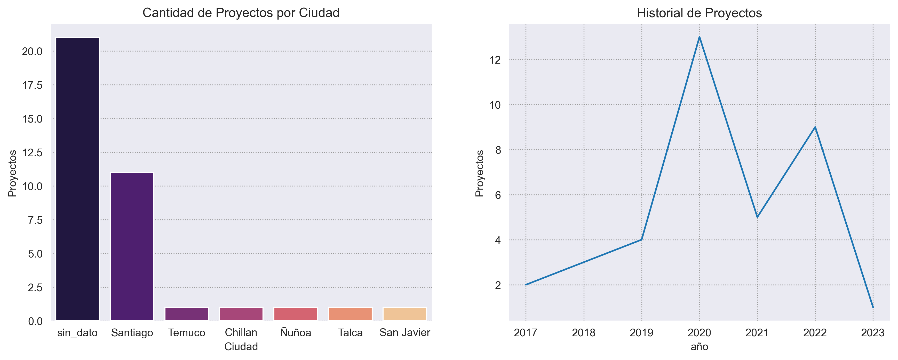
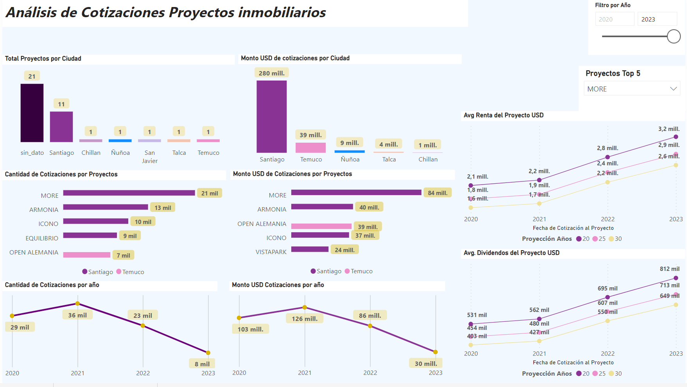

# <h1> Análisis Exploratorio de datos a las cotizaciones realizadas por usuarios  en una compañía inmobiliaria </h1> 

*El presente análisis de datos se desarrolla para dar cumplimiento al challence técnico propuesto por Moovmedia Group. Pretende realizar una evaluación a las métricas de una fuente de datos del sector inmobiliario a través de análisis estadísticos y visualización de datos.*

## 1. Introducción

Se analizan los datos suministrados por Moovmedia Group. Se realiza un EDA a datos de proyectos inmobiliarios en Chile para analizar el comportamiento de los usuarios en las cotizaciones que realizan por cada proyecto. Se desarrolla un Dashboard en Power BI para evaluar las métricas.

## 2. Objetivos

- Identificar 5 hallazgos significativos a partir del análisis de datos de diversas fuentes utilizando Python.
- Generar una clasificación de clientes que realizan cotizaciones a través de la visualización de los datos.

## 3. Recursos implementados

Python Versión: 3.9 
Packages:  Pandas, Matplotlib, Seaborn. 
Power BI.

## 3. Resultados

### 3.1 EDA

Se cargan los datos de origen y se realizan transformaciones.  

*Los datos de origen: [**data_origen**](/data/origen).* 
*Los datos transformados: [**data_transformed**](/data/transformed).* 

Al realizar el análisis exploratorio de los datos, se determina que:  

Hay un total de 35 proyectos distribuidos por el país. Desafortunadamente la fuente de datos no especifica para el 45% aprox la ciudad donde se desarrolla el proyecto. La ciudad donde más proyectos se ejecutan es Santiago. 

Se han realizado 95 mil cotizaciones. El proyecto al que más cotizaciones le realizan es el 6 con más de 20 mil cotizaciones avaladas en un total de 80M USD.  

Se observa una disminución en el numero de cotizaciones en el año 2022 de más del 50% respecto al año 2021, que es el año que más cotizaciones genero con un máximo de 35 mil.

*Los procesos realizados para el EDA están en el notebook:* [**1.EDA**](/1.EDA.ipynb)

### 3.2 Dashboard

Se desarrolla un dashboard en Power BI.  

Los proyectos que más cotizaciones han recibido son More, Armonia, Icono todos ubicados en Santiago. Los proyectos que más renta están proyectando a los próximos 20 años son Open Alemania en Temuco con 4.1m USD y More en Santiago con 3,2m USD.

El dashboard puede ser consultado en: [Dashboard](https://app.powerbi.com/view?r=eyJrIjoiMDhlMzkxN2ItYmJmNC00ODBiLTliYTEtZWEyMDg4ZmU4NTI2IiwidCI6ImRmODY3OWNkLWE4MGUtNDVkOC05OWFjLWM4M2VkN2ZmOTVhMCJ9) 

